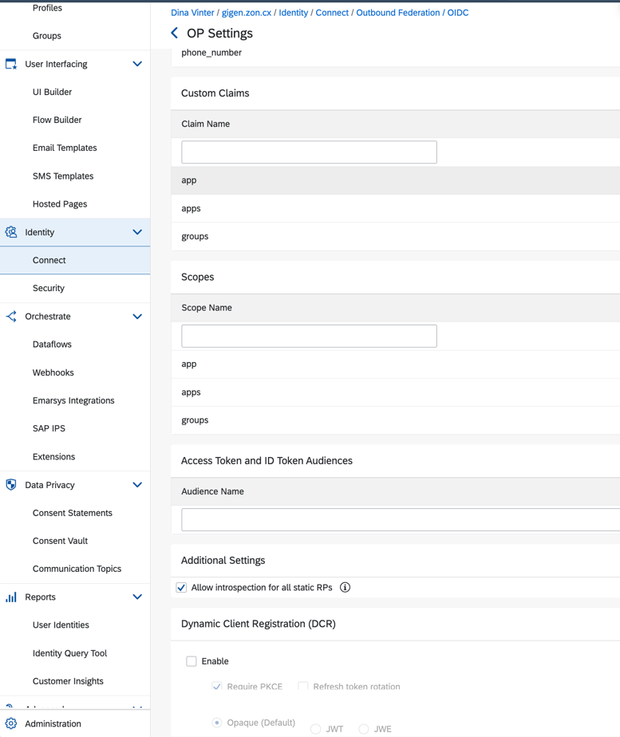
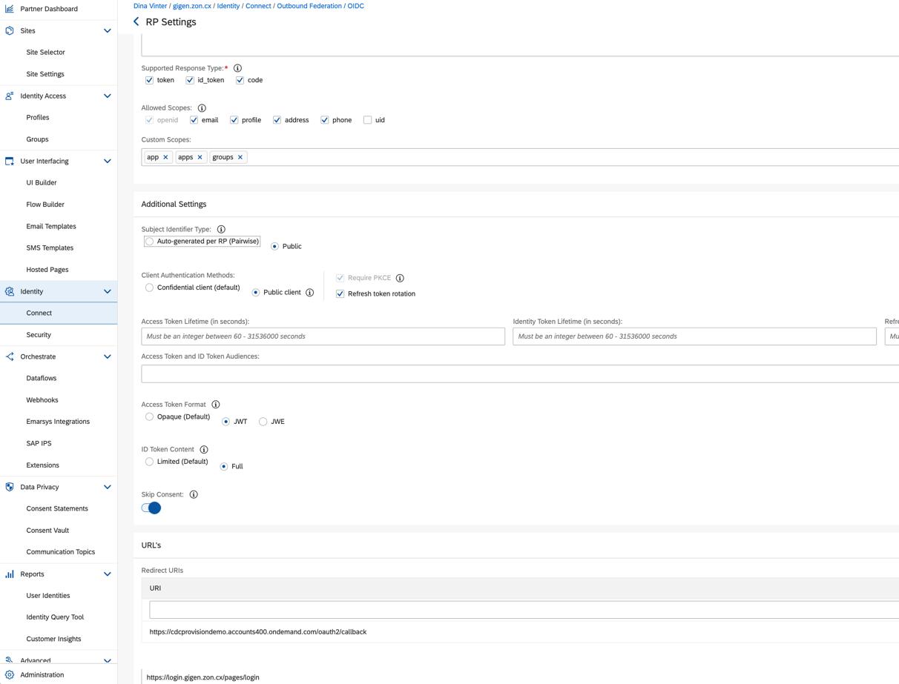
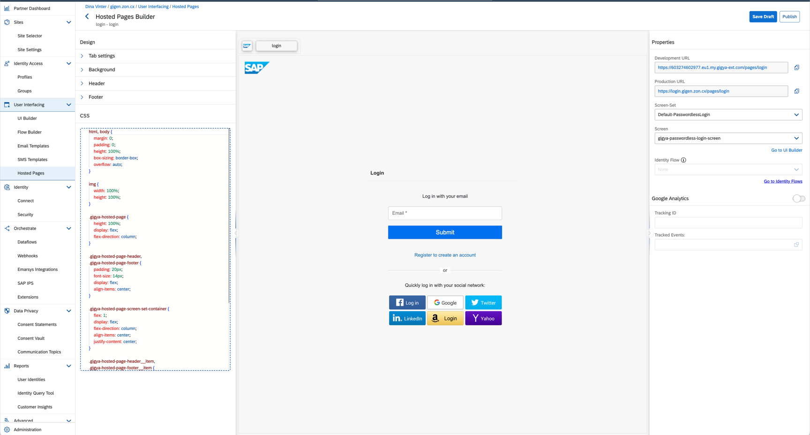
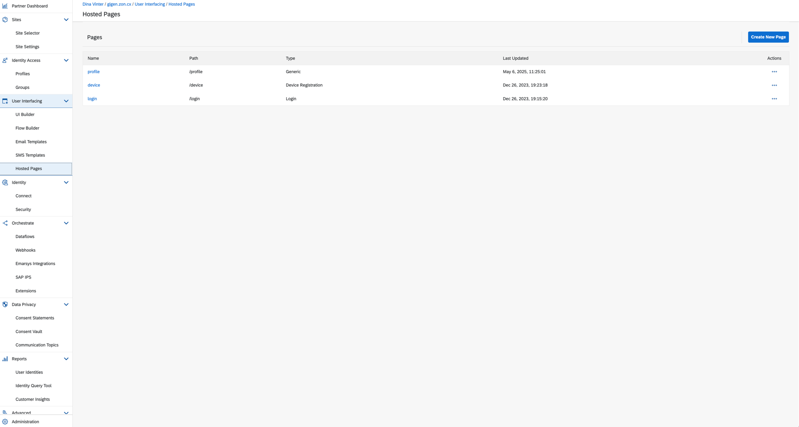
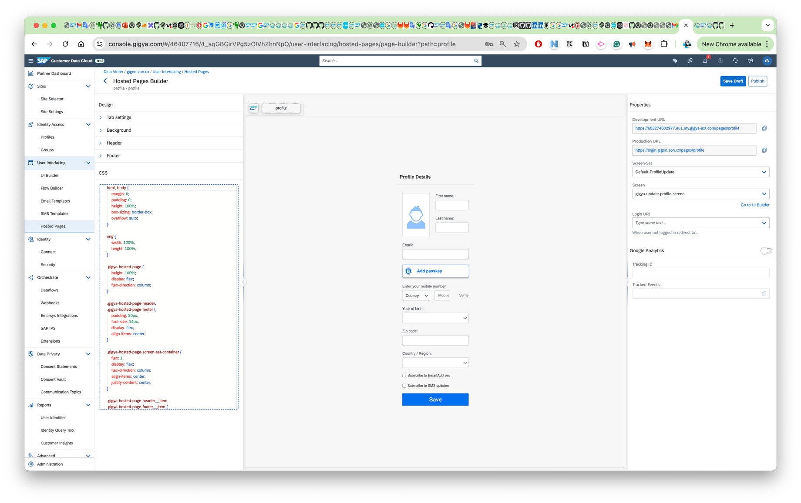

# IAS, CDC, AppRouter & AMS Integration
## Books Project
This project demonstrates how to integrate SAP Customer Data Cloud (CDC) as a corporate Identity Provider (IDP) in SAP Identity Authentication Service (IAS), and how to connect this setup with an AMS-enabled CAP application using an approuter for authentication and routing, and AMS (Authorization Management Service) for fine-grained authorization.

---

## Overview

- **SAP CDC**: Acts as a corporate IDP, providing user authentication via OIDC.
- **SAP IAS**: Central identity broker, federating CDC and other IDPs, issuing tokens for SAP applications.
- **AppRouter**: Handles authentication, routing, and token propagation to backend services.
- **AMS (Authorization Management Service)**: Enables attribute-based access control and policy enforcement in the CAP backend.

---

## Architecture Diagram

```
[User] → [CDC Login Page] → [IAS] → [AppRouter] → [CAP/AMS Backend]
```

---

## 1. Connecting CDC as a Corporate IDP in IAS

### a. CDC OIDC Configuration
- CDC is configured as an OIDC provider. See `trust/cdc.config.http` and `trust/cdc.config.provision.http` for provisioning and OIDC settings.
- Example OIDC discovery URL:
  - `https://fidm.eu1.gigya.com/oidc/op/v1.0/<apiKey>/.well-known/openid-configuration`

### b. IAS Identity Provider Setup
- Use the IAS Admin Console or API (see `trust/ias.config.http` and `idp/index.js`) to create a new IDP in IAS of type `openIdConnect`.
- Example payload (see `trust/ias.config.http`):
```json
{
  "name": "cdc-idp",
  "type": "openIdConnect",
  "oidcConfiguration": {
    "discoveryUrl": "https://fidm.eu1.gigya.com/oidc/op/v1.0/<apiKey>/.well-known/openid-configuration",
    "clientId": "<clientId>",
    "scopes": ["openid", "profile", "groups", "email"],
    "pkceEnabled": true
  },
  ...
}
```
- See `ias-config.json` for a full example of the IAS service instance configuration.

### c. Bind CDC IDP to IAS Application
- Use the PATCH API (see `trust/ias.config.http`) to set CDC as the default authenticating IDP for your IAS application.

---

## 2. AppRouter Integration

- The AppRouter (`app/router/xs-app.json`) is configured to use IAS for authentication:
  - All `/api/*` and `/user/*` routes require `authenticationType: "ias"`.
  - The login callback is set to `/login/callback?authType=ias`.
- The AppRouter is bound to the IAS service instance (see `mta.yaml` under `modules: approuter.nodejs`).

---

## 3. CAP Backend & AMS Integration

- The CAP backend (`srv/`) uses the `@sap/ams` plugin for attribute-based access control.
- Policies and schema are defined in `ams/dcl/` (see `schema.dcl` and `cap/basePolicies.dcl`).
- The backend is initialized with AMS in `srv/server.js`:
  - `amsCapPluginRuntime.authProvider` is used for authentication.
  - Policies are mapped and enforced at runtime.
- Example policy (see `ams/dcl/cap/basePolicies.dcl`):
```dcl
POLICY "Reader" {
    ASSIGN ROLE "Reader" WHERE (description IS NOT RESTRICTED OR genre IS NOT RESTRICTED) AND stock IS NOT RESTRICTED;
}
```

---

## 4. AMS Policies, Roles, and MyOrders Service

### AMS Policies
AMS (Authorization Management Service) policies define fine-grained, attribute-based access control for your application. Policies are written in DCL (Domain Control Language) files under `ams/dcl/`. They specify which roles are assigned to users under what conditions, and what those roles are allowed to do.

**Example: `ams/dcl/cap/basePolicies.dcl`**
```dcl
POLICY "Reader" {
    ASSIGN ROLE "Reader" WHERE (description IS NOT RESTRICTED OR genre IS NOT RESTRICTED) AND stock IS NOT RESTRICTED;
}

POLICY "authenticated_user" {
    ASSIGN ROLE "Reader" WHERE (description IS NOT RESTRICTED OR genre IS NOT RESTRICTED) AND stock IS NOT RESTRICTED;
}

POLICY Inquisitor {
    ASSIGN ROLE "Inquisitor" WHERE description IS NOT RESTRICTED;
}

POLICY "admin" {
    ASSIGN ROLE "admin";
}
```
- The `Reader` and `authenticated_user` policies assign the `Reader` role to users if certain conditions on the data are met.
- The `admin` policy assigns the `admin` role unconditionally.

When a user makes a request, AMS evaluates these policies in real time, using the user’s attributes and the data context, to determine what roles they have and what actions they can perform.

### Roles: `admin` and `authenticated-user`

#### `admin` Role
- **Definition:** Assigned by the `admin` policy in DCL.
- **Permissions:** Typically has full access to all administrative actions and data. Used for users who need to manage the system, data, or users.

#### `authenticated-user` Role
- **Definition:** Assigned by the `authenticated_user` policy in DCL.
- **Permissions:** General role for any user who has successfully authenticated (logged in). Used to restrict access to certain actions or entities to only logged-in users.

**Example usage in CDS:**
```cds
@restrict: [{ grant:['READ'], to: ['authenticated-user'] }]
service MyOrders@(path: '/my-orders', requires: 'authenticated-user')  {
  ...
}
```
- Only authenticated users can access the `MyOrders` service.

### The `my-orders` Service

**File:** `srv/my-orders.cds`

The `my-orders` service exposes order data specific to the currently logged-in user. It ensures that users can only see their own orders, not those of others.

- **Path:** `/my-orders`
- **Access Control:** The service and its entities are restricted to users with the `authenticated-user` role.
- **Entities:**
  - `Order`: Read-only, shows all orders for the current user (`where buyer=$user.id`).
  - `Product`: Read-only, shows products (books) but excludes the author field.

**CDS Example:**
```cds
@restrict: [{ grant:['READ'], to: ['authenticated-user'] }]
service MyOrders@(path: '/my-orders', requires: 'authenticated-user')  {
  @readonly
  entity Order as select from my.Orders { *, Items } where buyer=$user.id;
  @readonly 
  entity Product as projection on my.Books excluding { author };
}
```
- Only logged-in users can access `/my-orders`.
- Each user only sees their own orders.

**Summary Table**

| Role                | How Assigned                | What It Can Do                                  |
|---------------------|----------------------------|-------------------------------------------------|
| `admin`             | By policy, unconditionally | Full admin access (manage data, users, etc.)    |
| `authenticated-user`| By policy, on login        | Access to user-specific services like MyOrders  |

| Service     | Who Can Access         | What It Shows                                  |
|-------------|-----------------------|------------------------------------------------|
| MyOrders    | authenticated-user    | Only the current user's orders and products    |

---

## 5. Visual Reference

- 
- 
- 
- 
- 

---

## 6. Key Files & Directories

- `trust/ias.config.http` – Example IAS API calls for IDP setup
- `trust/cdc.config.http` – CDC OIDC/OP configuration
- `trust/cdc.config.provision.http` – CDC provisioning
- `ias-config.json` – IAS service instance config for Cloud Foundry
- `app/router/xs-app.json` – AppRouter route and authentication config
- `ams/dcl/` – AMS schema and policy definitions
- `srv/` – CAP backend with AMS integration

---

## 7. Deployment & Testing

1. **Provision CDC and configure OIDC** using the CDC admin APIs.
2. **Create and configure IAS service instance** using `ias-config.json`.
3. **Deploy AppRouter and CAP backend**, binding them to the IAS instance.
4. **Test login flow**: User is redirected to CDC login, authenticated, and receives access to the CAP backend via AppRouter.
5. **Verify authorization**: Policies in AMS control access to backend entities and actions.

---

## 8. Further Reading
- [SAP CDC Documentation](https://help.sap.com/docs/customer-data-cloud)
- [SAP IAS Documentation](https://help.sap.com/docs/identity-authentication)
- [SAP Authorization Management Service (AMS)](https://help.sap.com/docs/authorization-management-service)
- [CAP Documentation](https://cap.cloud.sap/docs/)

---

For questions or contributions, please refer to the code comments and configuration files, or contact the project maintainer.